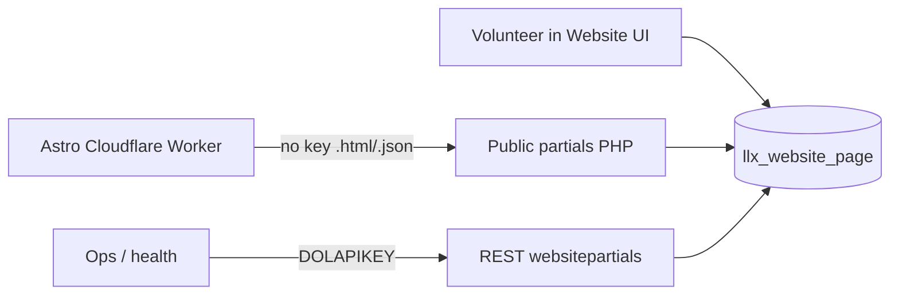

# Roadmap — website-partials

Milestone plan for the **Dolibarr `website-partials` custom module**: surface HTML content islands from the Website CMS over HTTPS for the [braypark.church](https://braypark.church) Astro site.

This file is the planning source of truth for **this repo**. Module PHP lives here and is installed onto the Dolibarr host (`admin.braypark.church` / `api.braypark.church`).

Progress on the module is recorded in [.progress/](.progress/) (Dot Progress).

## Status — v1.0

**Module complete.** P0–P2 are done and verified on the local module-dev stack (`partials.gandalf.lan`) via [`dev/test-consumption/`](dev/test-consumption/). Tagged **`v1.0`**.

| Phase | State |
|-------|--------|
| **P0** Spec & scaffold | **Done** |
| **P1** Public partials | **Done** |
| **P2** REST control plane | **Done** |

Consumer wiring, production deploy onto Bray Park Dolibarr, and ops hardening are **out of scope for this repo’s roadmap**. They live in **[roadmap-handover.md](roadmap-handover.md)** for [cloudflare-worker-braypark](https://github.com/ndx-video/cloudflare-worker-braypark) (Astro M1) and church ops.

---

## Locked decisions

| Decision | Choice |
|----------|--------|
| Authoring UX | Dolibarr [Website module](https://wiki.dolibarr.org/index.php/Module_Website#Introduction) UI — volunteers edit containers there |
| Module name / path | `websitepartials` → `htdocs/custom/websitepartials/` |
| Default website ref | `main-website` |
| Slug mapping | Dolibarr `pageurl` = island slug (e.g. `welcome`) |
| Public islands | **No API key** — published only |
| Public formats | **Both** `.html` (raw fragment) and `.json` (`{ slug, title, body, updatedAt }`) |
| REST control plane | **DOLAPIKEY** — full site + container CRUD (incl. DELETE); module-owned per-type rights; authoring UX remains Website UI |
| Drafts | Unpublished → `404` on public URLs; drafts only via keyed REST |
| PHP in page content | Public path serves **stored HTML only** — does **not** execute Website PHP |

Stock Dolibarr 22 has **no** Website REST API (`api_website*.class.php` does not exist). This module fills that gap with **public published islands** plus a **DOLAPIKEY** site/container control plane — without forking core or querying Postgres from a sidecar.

---

## Architecture



| Actor | Talks to | Auth |
|-------|----------|------|
| Volunteer | Website UI on `admin.braypark.church` | OIDC / Dolibarr session |
| Cloudflare Worker | Public partials HTTPS | None |
| Ops / monitoring | REST `/api/index.php/websitepartials/…` | `DOLAPIKEY` header |

---

## Public contract (no API key)

**Base URL (canonical):**

```text
https://admin.braypark.church/custom/websitepartials/public/
```

Alias host `https://api.braypark.church/…` may be used if Caddy routes the same Dolibarr docroot (same appliance).

### HTML fragment

```http
GET /custom/websitepartials/public/partials/{website_ref}/{slug}.html
Accept: text/html
```

| Response | Meaning |
|----------|---------|
| `200` `text/html` | Published page; body = `WebsitePage.content` (HTML fragment) |
| `404` | Missing website, missing page, or not published |
| `400` | Malformed slug / ref |

### JSON document

```http
GET /custom/websitepartials/public/partials/{website_ref}/{slug}.json
Accept: application/json
```

```json
{
  "slug": "welcome",
  "title": "Welcome",
  "body": "<p>…HTML fragment…</p>",
  "updatedAt": "2026-07-09T03:00:00+00:00"
}
```

| Field | Source |
|-------|--------|
| `slug` | `pageurl` |
| `title` | `title` |
| `body` | `content` (HTML, not executed) |
| `updatedAt` | `tms` / date_modification (ISO-8601) |

### Caching

Public responses SHOULD send cache-friendly headers, e.g.:

```http
Cache-Control: public, max-age=60, stale-while-revalidate=300
```

Exact values are set on the module setup page (`WEBSITEPARTIALS_CACHE_CONTROL`); the Worker may add its own cache layer later.

### Example (default site)

```text
GET …/partials/main-website/welcome.html
GET …/partials/main-website/welcome.json
```

---

## REST control plane (DOLAPIKEY)

Base: `https://admin.braypark.church/api/index.php/` (or `api.braypark.church`).

Auth: `DOLAPIKEY` header (same as other Dolibarr APIs). Login-via-password may be disabled on this appliance — use a user API key.

| Method | Path | Right (`websitepartials/…`) |
|--------|------|------------------------------|
| `GET` | `/websitepartials/status` | any module right (or `website/read`) |
| `GET` | `/websitepartials/websites` | `website/read` |
| `GET` | `/websitepartials/websites/{ref}` | `website/read` |
| `POST` | `/websitepartials/websites` | `website/write` |
| `PUT` | `/websitepartials/websites/{ref}` | `website/write` |
| `DELETE` | `/websitepartials/websites/{ref}` | `website/delete` |
| `GET` | `/websitepartials/websites/{ref}/pages` | `{type}/read` (query: `status`, `type`, pagination) |
| `GET` | `/websitepartials/websites/{ref}/pages/{slug}` | `{type}/read` for that container |
| `POST` | `/websitepartials/websites/{ref}/pages` | `{type}/write` |
| `PUT` | `/websitepartials/websites/{ref}/pages/{slug}` | `{type}/write` |
| `DELETE` | `/websitepartials/websites/{ref}/pages/{slug}` | `{type}/delete` |

Path `pages` means **containers** of any `type_container` (`page`, `blogpost`, `menu`, `banner`, `other`, `service`, `library`, `setup`). Permissions are module-owned nested toggles under **Users → Permissions → Website Partials** (`websitepartials/{object}/{read\|write\|delete}`). Core Website UI rights remain separate for volunteers.

Endpoints appear in `/api/index.php/explorer` when the module is enabled ([REST developer docs](https://wiki.dolibarr.org/index.php/Module_Web_Services_API_REST_(developer))).

---

## Module layout (this repo)

```text
htdocs/custom/websitepartials/
  README.md
  ChangeLog.md
  core/modules/modWebsitePartials.class.php
  admin/setup.php                    # public IP allowlist, cache, consumer URLs
  public/partial.php                 # router for .html / .json
  class/api_websitepartials.class.php
  lib/websitepartials.lib.php        # resolve website ref + pageurl + status + IP helpers
  langs/en_US/websitepartials.lang
```

Descriptor follows [Module development](https://wiki.dolibarr.org/index.php/Module_development) conventions for an external module under `htdocs/custom/`. Local module-dev stack: [`dev/`](dev/).

---

## Volunteer runbook (authoring)

1. Open **Websites** → site **`main-website`**.
2. **Add page/container** (or edit existing).
3. Set **page URL / alias** to the island slug (e.g. `welcome`) — this is the public `{slug}`.
4. Edit HTML content in the Website editor (no `<?php` required for public islands; PHP will not run on the public path).
5. **Publish** / set status so the page is live.
6. Verify:
   - `…/partials/main-website/welcome.json`
   - `…/partials/main-website/welcome.html`

Cognitive load stays on the Website UI; no API keys for volunteers.

---

## P0 — Spec & scaffold

**Goal:** Accept this roadmap; scaffold the external module in its own repo; enable it on Dolibarr 22.

**Done when:**

- [x] Module repo with `htdocs/custom/websitepartials/` tree ([ndx-video/dolibarr-mod-website-partials](https://github.com/ndx-video/dolibarr-mod-website-partials))
- [x] `modWebsitePartials.class.php` descriptor installs/enables under **Home → Setup → Modules** (verified on `partials.gandalf.lan`)
- [x] This file (`ROADMAP.md`) is the agreed contract for public + REST surfaces
- [x] README points here for module milestones; Astro M1 links to this repo

**Out of scope:** Public HTTP handlers, REST methods, Astro env wiring. Production host enablement is consumer/ops work — see [roadmap-handover.md](roadmap-handover.md).

---

## P1 — Public partials

**Goal:** Published HTML and JSON islands over HTTPS without an API key.

**Done when:**

- [x] `GET …/partials/{website_ref}/{slug}.html` returns `200` + `text/html` for a published page
- [x] `GET …/partials/{website_ref}/{slug}.json` returns the JSON shape above
- [x] Missing / unpublished / wrong ref → `404`
- [x] Page PHP is **not** executed (static `content` only)
- [x] Sensible `Cache-Control` on successful responses
- [x] Smoke test against a published container (e.g. `welcome`) on the module-dev stack / harness

**Out of scope:** Astro production `CONTENT_API_URL`, draft preview URLs

---

## P2 — REST control plane

**Goal:** Keyed site + container CRUD for ops and tooling (authoring UX remains Website UI).

**Done when:**

- [x] `GET /api/index.php/websitepartials/status` with valid `DOLAPIKEY` → `200`
- [x] Site CRUD (`GET/POST/PUT/DELETE websites…`) gated by `websitepartials/website/*`
- [x] Container CRUD for all `type_container` values, gated per type
- [x] `DELETE` page/site works; missing type write → `403`
- [x] Invalid/missing key → `401`
- [x] Endpoints visible in API explorer when the module is enabled
- [x] Module rights appear under Users → Permissions → Website Partials

**Out of scope:** Granting broad ERP rights to the `website` user; public keyed HTML; clone/categories/media

---

## Non-goals

- Forking Dolibarr core
- Go / GraphQL / gRPC service reading `llx_website*` directly as the primary CMS API
- API key on published HTML/JSON islands
- Executing Website container PHP on the public partials path
- Replacing the Website module UI with another authoring tool
- Using Website “Deploy to Apache” as the public site (Astro on Cloudflare remains the site)
- Astro / Cloudflare Worker consumer wiring (see [roadmap-handover.md](roadmap-handover.md))

---

## Working convention

| Document | Role |
|----------|------|
| **This file** (`ROADMAP.md`) | Module milestones **P0–P2** (complete at v1.0) and public/REST contracts |
| [roadmap-handover.md](roadmap-handover.md) | Consumer + ops work formerly P3/P4 — for the Astro repo / church ops |
| [README.md](README.md) | Module overview and local-dev notes |
| [AGENTS.md](AGENTS.md) | Agent orientation; P0–P2 ↔ M000–M002 mapping |
| [.progress/](.progress/) | Append-only history for work in *this* repo |
| Astro [ROADMAP.md](https://github.com/ndx-video/cloudflare-worker-braypark/blob/main/ROADMAP.md) | Site milestones; M1 consumes this module |

**Plan in ROADMAP. Record in `.progress/`. Module v1.0 is complete; further consumer work is handed off.**
