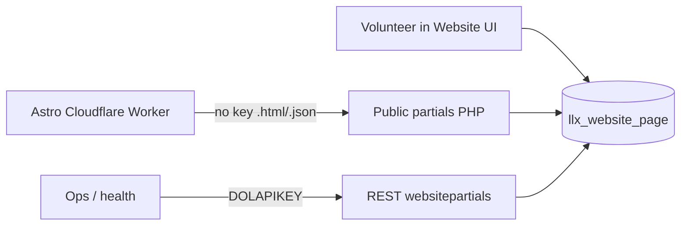

# Roadmap — website-partials

Milestone plan for the **Dolibarr `website-partials` custom module**: surface HTML content islands from the Website CMS over HTTPS for the [braypark.church](https://braypark.church) Astro site.

This file is the planning source of truth for **this repo**. Module PHP is built here and deployed onto the Dolibarr host (`admin.braypark.church` / `api.braypark.church`). The Astro site ([ndx-video/cloudflare-worker-braypark](https://github.com/ndx-video/cloudflare-worker-braypark)) is the **consumer** — see that repo’s `ROADMAP.md` M1 and `src/lib/content-api.ts`.

Progress on the module is recorded in this repo (Dot Progress once adopted). Consumer wiring progress lives in the Astro repo’s `.progress/`.

---

## Locked decisions

| Decision | Choice |
|----------|--------|
| Authoring UX | Dolibarr [Website module](https://wiki.dolibarr.org/index.php/Module_Website#Introduction) UI — volunteers edit containers there |
| Module name / path | `websitepartials` → `htdocs/custom/websitepartials/` |
| Default website ref | `main-website` |
| Slug mapping | Dolibarr `pageurl` = island slug (e.g. `welcome`) |
| Public islands | **No API key** — published only |
| Public formats | **Both** `.html` (raw fragment) and `.json` (`{ slug, title, body, updatedAt }`) |
| REST control plane | **DOLAPIKEY** — health + list/query; no write API in v1 |
| Drafts | Unpublished → `404` on public URLs; drafts only via keyed REST |
| PHP in page content | Public path serves **stored HTML only** — does **not** execute Website PHP |

Stock Dolibarr 22 has **no** Website REST API (`api_website*.class.php` does not exist). This module fills that gap for **read/publish** of partials without forking core or querying Postgres from a sidecar.

---

## Architecture



| Actor | Talks to | Auth |
|-------|----------|------|
| Volunteer | Website UI on `admin.braypark.church` | OIDC / Dolibarr session |
| Cloudflare Worker | Public partials HTTPS | None |
| Ops / monitoring | REST `/api/index.php/websitepartials/…` | `DOLAPIKEY` header |

---

## Public contract (no API key)

**Base URL (canonical):**

```text
https://admin.braypark.church/custom/websitepartials/public/
```

Alias host `https://api.braypark.church/…` may be used if Caddy routes the same Dolibarr docroot (same appliance).

### HTML fragment

```http
GET /custom/websitepartials/public/partials/{website_ref}/{slug}.html
Accept: text/html
```

| Response | Meaning |
|----------|---------|
| `200` `text/html` | Published page; body = `WebsitePage.content` (HTML fragment) |
| `404` | Missing website, missing page, or not published |
| `400` | Malformed slug / ref |

### JSON document

```http
GET /custom/websitepartials/public/partials/{website_ref}/{slug}.json
Accept: application/json
```

```json
{
  "slug": "welcome",
  "title": "Welcome",
  "body": "<p>…HTML fragment…</p>",
  "updatedAt": "2026-07-09T03:00:00+00:00"
}
```

| Field | Source |
|-------|--------|
| `slug` | `pageurl` |
| `title` | `title` |
| `body` | `content` (HTML, not executed) |
| `updatedAt` | `tms` / date_modification (ISO-8601) |

### Caching

Public responses SHOULD send cache-friendly headers, e.g.:

```http
Cache-Control: public, max-age=60, stale-while-revalidate=300
```

Exact values are tunable in P1/P4; Worker may add its own cache layer later.

### Example (default site)

```text
GET …/partials/main-website/welcome.html
GET …/partials/main-website/welcome.json
```

---

## REST control plane (DOLAPIKEY)

Base: `https://admin.braypark.church/api/index.php/` (or `api.braypark.church`).

Auth: `DOLAPIKEY` header (same as other Dolibarr APIs). Login-via-password may be disabled on this appliance — use a user API key.

| Method | Path | Purpose |
|--------|------|---------|
| `GET` | `/websitepartials/status` | Health: module enabled, Dolibarr version, optional DB ping |
| `GET` | `/websitepartials/websites` | List website refs the caller may see |
| `GET` | `/websitepartials/websites/{ref}/pages` | List pages (query: `status=published\|all`, pagination) |
| `GET` | `/websitepartials/websites/{ref}/pages/{slug}` | Metadata (+ optional `content` for drafts when permitted) |

**v1:** read-only. No create/update/delete via REST — authoring stays in the Website UI.

Endpoints must appear in `/api/index.php/explorer` when the module is enabled ([REST developer docs](https://wiki.dolibarr.org/index.php/Module_Web_Services_API_REST_(developer))).

---

## Module layout (implement elsewhere)

```text
htdocs/custom/websitepartials/
  README.md
  ChangeLog.md
  core/modules/modWebsitePartials.class.php
  public/partial.php                 # router for .html / .json
  class/api_websitepartials.class.php
  lib/websitepartials.lib.php        # resolve website ref + pageurl + status
```

Descriptor follows [Module development](https://wiki.dolibarr.org/index.php/Module_development) conventions for an external module under `htdocs/custom/`.

---

## Astro consumer alignment

Today the Astro consumer’s `src/lib/content-api.ts` expects:

```text
GET {CONTENT_API_URL}/islands/{slug}
→ { id, slug, title, body, updatedAt? }
```

**P3 target:**

1. Set Worker `CONTENT_API_URL` to the public partials base (or a thin alias that preserves `/islands/{slug}`).
2. Prefer **`.json`** so `ContentBlock` stays JSON; map `body` as HTML.
3. Update Astro `ContentIsland.astro` to render `body` as HTML (trusted CMS fragment), not plain text.
4. Default `website_ref` = `main-website` (env override allowed, e.g. `CONTENT_WEBSITE_REF`).

Suggested fetch shape after wiring:

```text
{CONTENT_API_URL}/partials/main-website/{slug}.json
```

or keep `/islands/{slug}` as a rewrite/alias on the Dolibarr or Caddy side so the Astro client stays stable.

---

## Volunteer runbook (authoring)

1. Open **Websites** → site **`main-website`**.
2. **Add page/container** (or edit existing).
3. Set **page URL / alias** to the island slug (e.g. `welcome`) — this is the public `{slug}`.
4. Edit HTML content in the Website editor (no `<?php` required for public islands; PHP will not run on the public path).
5. **Publish** / set status so the page is live.
6. Verify:
   - `…/partials/main-website/welcome.json`
   - `…/partials/main-website/welcome.html`
7. After Astro P3: confirm the island on [braypark.church](https://braypark.church).

Cognitive load stays on the Website UI; no API keys for volunteers.

---

## P0 — Spec & scaffold

**Goal:** Accept this roadmap; scaffold the external module in its own repo; enable it on Dolibarr 22.

**Done when:**

- [ ] Module repo (or `custom/websitepartials` tree) exists outside this Astro repo
- [ ] `modWebsitePartials.class.php` descriptor installs/enables under **Home → Setup → Modules**
- [ ] Module appears enabled on the Bray Park Dolibarr instance (22.x)
- [ ] This file (`ROADMAP.md`) is the agreed contract for public + REST surfaces
- [ ] README points here for module milestones; Astro M1 links to this repo

**Out of scope:** Public HTTP handlers, REST methods, Astro env wiring

---

## P1 — Public partials

**Goal:** Published HTML and JSON islands over HTTPS without an API key.

**Done when:**

- [ ] `GET …/partials/{website_ref}/{slug}.html` returns `200` + `text/html` for a published page
- [ ] `GET …/partials/{website_ref}/{slug}.json` returns the JSON shape above
- [ ] Missing / unpublished / wrong ref → `404`
- [ ] Page PHP is **not** executed (static `content` only)
- [ ] Sensible `Cache-Control` on successful responses
- [ ] Smoke test against `main-website` with at least one published container (e.g. `welcome`)

**Out of scope:** REST explorer, Astro production `CONTENT_API_URL`, draft preview URLs

---

## P2 — REST control plane

**Goal:** Keyed health and query APIs for ops and tooling.

**Done when:**

- [ ] `GET /api/index.php/websitepartials/status` with valid `DOLAPIKEY` → `200`
- [ ] List published pages for `main-website` via keyed REST
- [ ] Invalid/missing key → `401`
- [ ] Endpoints visible in API explorer
- [ ] No write (POST/PUT/DELETE) routes in v1

**Out of scope:** Granting broad ERP rights to the `website` user; public keyed HTML

---

## P3 — Astro wiring

**Goal:** Live content islands on the Cloudflare Worker from published partials.

**Done when:**

- [ ] `CONTENT_API_URL` set in production (Worker var) to the public partials base or `/islands` alias
- [ ] Astro `content-api.ts` fetches `.json` (or alias) and maps to `ContentBlock`
- [ ] Astro `ContentIsland.astro` renders HTML `body` safely as trusted CMS HTML
- [ ] Error handling / placeholder fallback when the origin is unreachable
- [ ] At least one real island (`welcome`) served in production — satisfies Astro ROADMAP M1

**Out of scope:** Migrating all static page copy into Dolibarr; removing the beta password gate

---

## P4 — Hardening & runbook

**Goal:** Production-ready ops notes and volunteer-safe publishing.

**Done when:**

- [ ] CORS policy documented (Worker server-side fetch may need none; browser fetch must not be required)
- [ ] Optional edge allowlist / Tunnel notes (Worker → Dolibarr) documented
- [ ] Rate-limit or abuse notes for the public path
- [ ] Volunteer runbook (above) copied into module README and linked from church ops docs
- [ ] Confirm drafts never leak on public URLs

**Out of scope:** Cloudflare Access on public partials; Turnstile; write REST

---

## Non-goals

- Forking Dolibarr core
- Go / GraphQL / gRPC service reading `llx_website*` directly as the primary CMS API
- API key on published HTML/JSON islands
- Executing Website container PHP on the public partials path
- Replacing the Website module UI with another authoring tool
- Using Website “Deploy to Apache” as the public site (Astro on Cloudflare remains the site)

---

## Working convention

| Document | Role |
|----------|------|
| **This file** (`ROADMAP.md`) | Partials module milestones (P0–P4) and public/REST contracts |
| [README.md](README.md) | Module overview; expand with install notes as code lands |
| Astro [ROADMAP.md](https://github.com/ndx-video/cloudflare-worker-braypark/blob/main/ROADMAP.md) | Site milestones; M1 consumes this module at P3 |
| Astro `.progress/` | Consumer wiring history |

**Plan and implement the module in this repo. Wire the Astro consumer at P3.**
